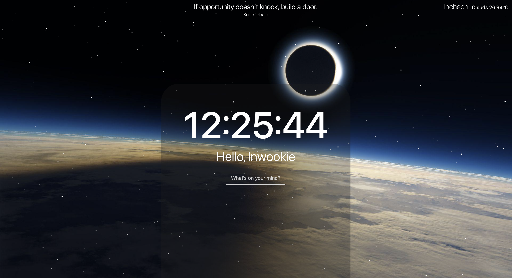

# To-Do List | Vanilla JS

This project was created based on the inspiration of the dynamic movements of the stars. It used OpenWeather API to gain geolocation feature and quotes and background is shown at random order.
 

## Demo

[To-Do List Demo](https://inwookie.github.io/To-Do/)

<image src="./demo/demo.gif" />

## Available Backgrounds

 

## Stack

### Front-end

  

## Theory

- Variables
- Functions
- Data Types
- Arrays, Objects
- DOM Functions
- Events
- if / else / for
